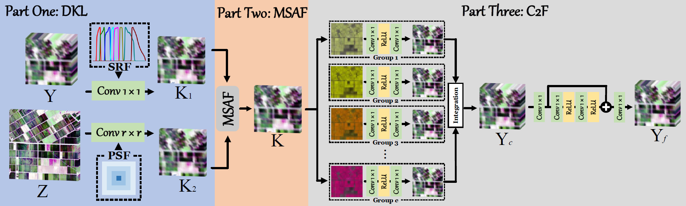
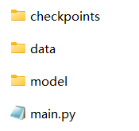

# UMC2FF_GRSL
Model-guided Coarse-to-fine Fusion Network for Unsupervised Hyperspectral Image Super-resolution, GRSL. (PyTorch)

WeChat: BatAug

Our paper is accpeted by IEEE Geoscience and Remote Sensing Letters (GRSL). 
More information can be found in my [Google Scholar Citations](https://scholar.google.com/citations?user=aSPDpmgAAAAJ&hl=zh-CN).

**Fig.1.** Overall Pipeline of proposed UMC2FF, abbreviated as UMC2FF, for the task of unsupervised hyperspectral image super-resolution.

## Directory structure

**Fig.2.** Directory structure. There are three folders and one main.py files in UMC2FF_GRSL-main.

### checkpoints
This folder is used to store the training results and a folder named `TG_SF12` is given as an example.

- `BlindNet.pth` is the trained parameters of Part One-DKL.

- `estimated_lr_msi.mat` is the K1 and K2.

- `estimated_psf_srf.mat` is the estimated PSF and SRF.

- `hr_msi.mat` and `lr_hsi.mat`  are simulated results as the input of our method.

- `opt.txt` is the configuration of our method.

- `Out.mat` is the output of our method.

- `psf_gt.mat` and  `srf_gt.mat` are the GT PSF and SRF.

- `Stage1.txt` is the result of Part One-DKL.

- `Stage2_Spe.txt` is the result of Part two and three.
  
### data
This folder is used to store the ground true HSI and corresponding spectral response of multispectral imager, aiming to generate the simulated inputs. The TianGong-1 HSI data and spectral response of WorldView 2 multispectral imager are given as an example here.

### model
This folder consists seven .py files, including 
- `__init__.py`

- `config.py`: all the hyper-parameters can be adjusted here.

- `evaluation.py`: to evaluate the metrics.

- `network.py`: store all modules.

- `read_data.py`: read and simulate data

- `spectral_SR_fusion_C2F.py`: part two and three.

- `srf_psf_layer.py`: part one.

### main
- `main.py`: main.py

## How to run our code
- Requirements: codes of networks were tested using PyTorch 1.9.0 version (CUDA 11.4) in Python 3.8.10 on Windows system. For the required packages, please refer to detailed .py files.

- Parameters: all the parameters need fine-tunning can be found in `config.py`.

- Data: put your HSI data and MSI spectral reponse in `./data/XINet/TG` and `./data/XINet/spectral_response`, respectively.The TianGong-1 HSI data and spectral response of WorldView 2 multispectral imager are given as an example here.

- Run: just simply run `main.py` after adjust the parameters in `config.py`.

- Results: one folder named `TG_SF12` will be generated once `main.py` is run and all the results will be stored in the new folder. A folder named `TG_SF12` is given as an example here.

## References

Our work is inspired by the following paper

+ **Jiaxin Li**, Ke Zheng, Zhi Li, Lianru Gao, Xiuping Jia. X-shaped Interactive Autoencoders with Cross-Modality Mutual Learning for Unsupervised Hyperspectral Image Super-resolution[J]. IEEE Transactions on Geoscience and Remote Sensing, early access.
+ **Jiaxin Li**, Danfeng Hong, Lianru Gao, Jing Yao, Ke Zheng, Bing Zhang, Jocelyn Chanussot. Deep learning in multimodal remote sensing data fusion: A comprehensive review[J]. International Journal of Applied Earth Observation and Geoinformation, 2022, 112: 102926.
+ **Jiaxin Li**, Ke Zheng, Jing Yao, Lianru Gao, Danfeng Hong. Deep unsupervised blind hyperspectral and multispectral data fusion[J]. IEEE Geoscience and Remote Sensing Letters, 2022, 19: 1-5. (**ESI Highly cited Papers**)
+ Lianru Gao, **Jiaxin Li**, Ke Zheng, Xiuping Jia. Enhanced Autoencoders with Attention-embedded Degradation Learning for Unsupervised Hyperspectral Image Super-resolution[J]. IEEE Transactions on Geoscience and Remote Sensing, 2023, 61, 1-17.

## Contact

If you encounter any bugs while using this code, please do not hesitate to contact us.
